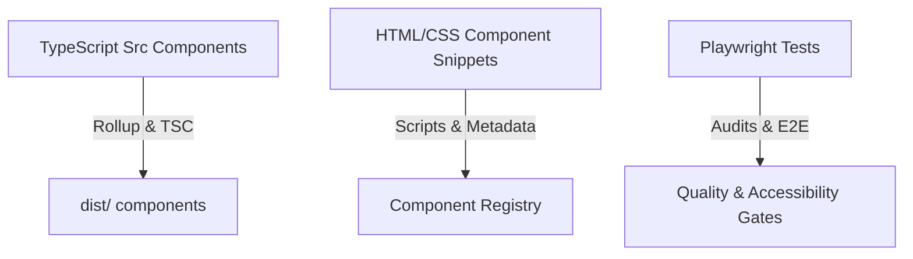

# Architecture Overview

This document provides a technical overview of the **UI-Verse** repository, its directory layout, component standardizations, compilation process, and automated quality checks.

---

## 🏗️ System Architecture

UI-Verse acts as a static component library, showcasing Vanilla HTML/CSS/JS snippets along with modern Web Components built from TypeScript sources.

### High-Level Component Flow

---

## 📂 Key Folders & Layout

- **`components/`**: House individual standalone UI modules and component files.
- **`src/`**: Houses the TypeScript sources for core web components, compiled using Rollup.
- **`scripts/`**: Houses automation scripts for:
  - Component discovery (`component-discovery-runner.js`)
  - Metadata verification (`component-metadata.js`)
  - Locales and i18n synchronization (`i18n-sync.js`)
  - Performance budgets and monitoring (`performance-monitor.js`)

---

## ⚙️ Compilation & Build Pipeline

1. **Type Compilation**: Runs `tsc` to verify static types and generate definitions.
2. **Rollup Bundling**: Combines TypeScript modules into clean CJS and ESM distributions.
3. **i18n Verification**: Syncs and validates localized translation tables across targets.

---

## 🧪 Local Testing & Quality Gates

Ensure all guidelines are satisfied by running quality gate command sequences:
- CSS Code Style: `npm run lint:css`
- Markup Standards: `npm run lint:html`
- Versioning Rules: `npm run components:version:check`
